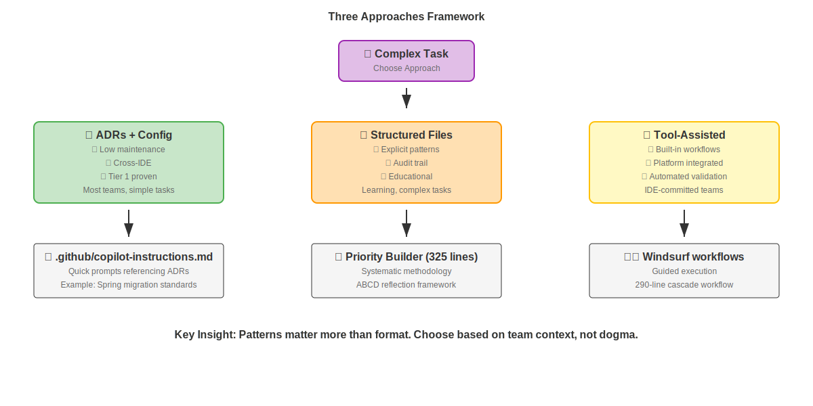
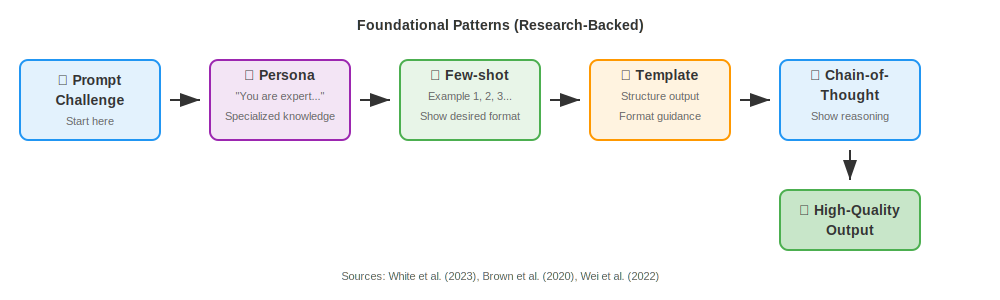

<!-- _class: hero -->

# Prompt Engineering Bootcamp
**SESSION 1**: Industry Standards & Real-World Application

*From Ad-Hoc Prompting → Systematic Approaches*

**Duration**: 60 minutes | **Format**: 20min lecture + 35min hands-on + 5min wrap

---

<!-- _class: agenda -->

## Today's Agenda

| Time | Activity | Type |
|------|----------|------|
| **0-5 min** | Problem & Solution Overview | 📊 **LECTURE** |
| **5-15 min** | Three Approaches Framework | 📊 **LECTURE** |
| **15-20 min** | Foundational Patterns | 📊 **LECTURE** |
| **20-25 min** | 🎯 **DEMO: Priority Builder** | 🔴 **HANDS-ON** |
| **25-45 min** | 🎯 **YOUR TURN: Build Priorities** | 🔴 **HANDS-ON** |
| **45-55 min** | 🎯 **COMPARE: Three Approaches** | 🔴 **HANDS-ON** |
| **55-60 min** | Wrap & Session 2 Preview | 📊 **LECTURE** |

---

<!-- _class: problem -->

## The Problem: Ad-Hoc AI Prompting

**Current State for Most Professionals:**

```
Professional: "Hey AI, help me write my FY26 priorities"
AI: *generates generic priorities*
Professional: "These don't capture my impact... try again"
AI: *generates different generic priorities*  
Professional: "Still missing key metrics..."
```

**❌ Problems:**
- Every prompt starts from scratch
- No team knowledge captured in prompts
- Inconsistent results across attempts
- Can't reuse successful approaches

---

<!-- _class: solution -->

## The Solution: Industry Standards

**Today you'll learn:**

✅ **Three valid approaches** for systematic prompting  
✅ **When to use each approach** (decision framework)  
✅ **Foundational patterns** in action (not theory)  
✅ **Real deliverable** (actual FY26 priorities)

**Key insight**: Patterns matter more than format. Choose based on team needs, not dogma.

---

<!-- _class: theory -->

## Three Valid Approaches Framework



**Key Insight**: Patterns matter more than format. Choose based on team context, not dogma.

---

<!-- _class: theory -->

## Tier Framework for Evaluation

**Use this to evaluate any prompt engineering approach:**

**🟢 Tier 1: Proven (10+ years)**
- Architecture Decision Records (ADRs)
- Few-shot prompting, Chain-of-Thought
- Used by: Microsoft, AWS, Google, Netflix

**🟡 Tier 2: Production Ready (1-3 years)**  
- `.github/copilot-instructions.md`
- ReAct pattern
- Growing enterprise adoption

**🟠 Tier 3: Experimental (<2 years)**
- Spec-kit workflows, structured prompt files
- Tool-specific approaches
- Interesting but unproven at scale

---

<!-- _class: theory -->

## Foundational Patterns (Research-Backed)



**Sources**: White et al. (2023), Brown et al. (2020), Wei et al. (2022)

**Today**: See these patterns in a real 325-line Priority Builder system

---

<!-- _class: transition -->

# 🎯 HANDS-ON TIME
**Next 35 minutes: Build actual FY26 priorities**

*Put theory into practice with real deliverables*

---

<!-- _class: demo -->

## 🎯 **DEMO: Priority Builder in Action** (5 minutes)

**What you're about to see:**

I'll demonstrate a **325-line Priority Builder Agent** that uses all 4 foundational patterns:

- 🎭 **Persona**: "You are an expert career coach specializing in professional priorities..."
- 📚 **Few-shot**: Built-in priority examples and ABCD reflections  
- 📋 **Template**: Structured CSV output + formatted summaries
- 🧠 **Chain-of-Thought**: ABCD reflection framework

**Demo scenario**: "Senior Analyst - AI Strategy" role
**Watch for**: How patterns create consistent, high-quality output

---

<!-- _class: exercise -->

## 🎯 **YOUR TURN: Freestyle First** (10 minutes)

**Task**: Create 1 priority for your chosen demo persona

**Choose your persona:**
- **Option A**: Delivery Lead - Client Experience (8 yrs, team management)
- **Option B**: Tech Lead - Banking Automation (5 yrs, AI/ML specialist)  
- **Option C**: Associate Manager - Digital Strategy (6 yrs, transformation)

**Challenge**: Use your AI tool however you normally would
**Goal**: 1 priority in ANY category with basic ABCD reflection

**Materials**: Demo persona descriptions provided

---

<!-- _class: exercise -->

## 🎯 **YOUR TURN: Priority Builder Template** (15 minutes)

**Task**: Use the complete Priority Builder Agent

**Process:**
1. **Load the prompt**: Copy 325-line Priority_Builder_Agent_Prompt.txt
2. **Choose different persona**: Pick different option from freestyle round
3. **Follow 20 Questions**: Let the agent guide you through analysis  
4. **Select version**: Conservative, Balanced, or Aspirational
5. **Export CSV**: Get production-ready format

**Success criteria**: Complete ABCD reflections + CSV output ready for Workday

---

<!-- _class: exercise -->

## 🎯 **COMPARE: Three Approaches** (10 minutes)

**See the same Spring migration task using all three approaches:**

**Approach A (ADRs + Config)**: 
```
"Following .github/copilot-instructions.md, migrate UserController to Spring Boot 3"
```

**Approach B (Structured Files)**:
Load: knowledge-base.md → specification.md → implementation-plan.md

**Approach C (Tool-Assisted)**:
Windsurf cascade workflow (290-line systematic methodology)

**Observe**: Same result, different structure and maintenance overhead

---

<!-- _class: insights -->

## Key Insights: Template vs Freestyle

**What you probably observed:**

**Freestyle Results:**
- Generic priorities that could apply to anyone
- Missing specific metrics and quantification  
- Weak ABCD reflections
- Inconsistent quality

**Priority Builder Results:**
- Persona-driven expertise and specificity
- Structured questioning ensures completeness
- Built-in examples guide quality standards
- Consistent CSV format for submission

**When is overhead worth it?** Complex domains, high stakes, repeated use, team consistency

---

<!-- _class: theory -->

## Real-World Application Across Domains

**The patterns you practiced work everywhere:**

**Business Applications:**
- Strategic planning documents
- Performance reviews and goal setting
- Client presentations and proposals
- Training material development

**Technical Applications:**  
- Code migration and refactoring
- Architecture documentation
- Troubleshooting workflows
- System design patterns

**Key principle**: Same systematic thinking, different domains

---

<!-- _class: wrap -->

## Session 1 Wrap-Up

**What you accomplished:**
✅ Learned Three Approaches evaluation framework  
✅ Recognized foundational patterns in real prompts
✅ Generated actual FY26 priorities using systematic approach
✅ Compared freestyle vs structured methodologies

**Next Session**: Advanced patterns + live Java demo
- ReAct and Tree of Thoughts for complex reasoning
- Interview prep using systematic workflows
- Live Spring Boot migration demonstration

---

<!-- _class: preview -->

## Session 2 Preview

**Coming up in 60 minutes:**

🔄 **Advanced Patterns**: ReAct (Think→Act→Observe) and Tree of Thoughts
🎯 **Interview Prep Workflow**: Systematic approach to strategic positioning
🖥️ **Live Java Demo**: Spring Boot migration using same patterns
📁 **Spec-kit Methodology**: 3-4 file workflows for complex tasks

**Bring for Session 2**: A job description you're interested in (or use provided samples)

---

<!-- _class: hero -->

# Questions?

**Open discussion on:**
- Pattern recognition and application
- When to use which approach
- Adapting to your team context
- Challenges and solutions

*5-minute break, then Session 2*
