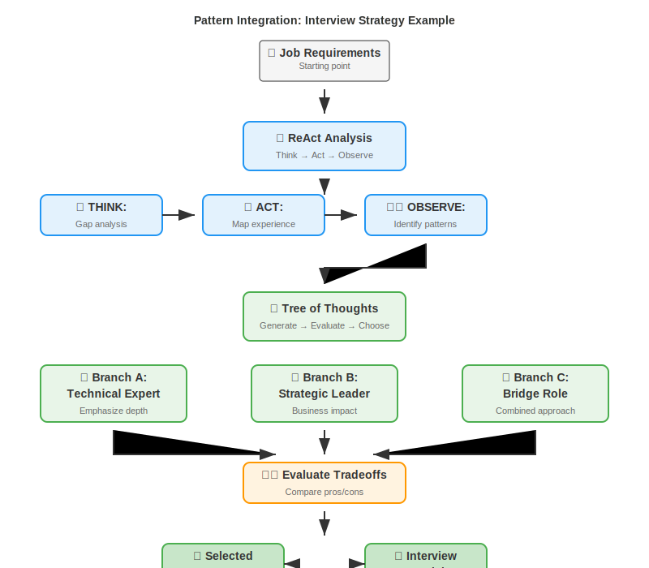
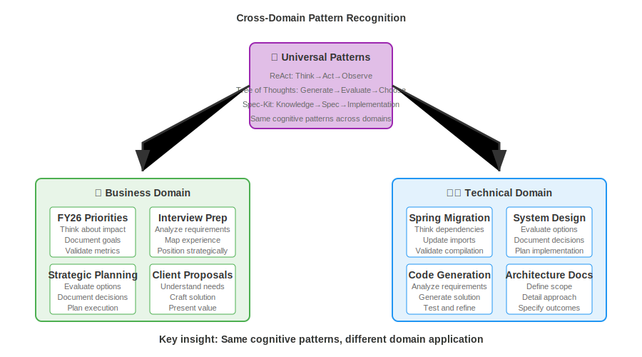

<!-- _class: hero -->

# Advanced Patterns & Complete Workflows
**SESSION 2**: From Simple Templates → Orchestrated Systems

*ReAct + Tree of Thoughts + Live Java Demo*

**Duration**: 60 minutes | **Format**: 15min lecture + 40min hands-on + 5min wrap

---

<!-- _class: agenda -->

## Today's Agenda

| Time | Activity | Type |
|------|----------|------|
| **0-5 min** | Session 1 Recap + Advanced Patterns | 📊 **LECTURE** |
| **5-10 min** | Spec-Kit Methodology | 📊 **LECTURE** |
| **10-15 min** | ReAct + Tree of Thoughts Overview | 📊 **LECTURE** |
| **15-25 min** | 🎯 **DEMO: Interview Prep Workflow** | 🔴 **HANDS-ON** |
| **25-40 min** | 🎯 **YOUR TURN: Build Interview Materials** | 🔴 **HANDS-ON** |
| **40-55 min** | 🎯 **LIVE JAVA DEMO: Spring Migration** | 🔴 **HANDS-ON** |
| **55-60 min** | Integration + Next Steps | 📊 **LECTURE** |

---

<!-- _class: recap -->

## Session 1 Recap: Foundation Established

**You mastered:**
✅ **Three Approaches Framework** (ADRs vs Structured vs Tool-assisted)  
✅ **Tier Evaluation** (proven vs emerging vs experimental)
✅ **Foundational Patterns** (Persona, Few-shot, Template, Chain-of-Thought)
✅ **Real application** (Priority Builder with actual deliverables)

**Today's evolution:**
Simple patterns → **Orchestrated workflows**
Single-step tasks → **Multi-phase reasoning**
Generic applications → **Cross-domain scaling**

---

<!-- _class: theory -->

## Advanced Patterns (Research-Backed)

**When simple patterns aren't enough for complex tasks:**

🔄 **ReAct Pattern** (Yao et al., 2022)
- **Format**: Think → Act → Observe → Think → Act...
- **Use**: Multi-step tasks with validation checkpoints

🌳 **Tree of Thoughts** (Yao et al., 2023)  
- **Format**: Generate alternatives → Evaluate → Choose best
- **Use**: Decision points with tradeoffs

📁 **Spec-Kit Methodology** (Your proven approach)
- **Format**: 3-4 structured files working together
- **Use**: Complex tasks requiring systematic breakdown

---

<!-- _class: theory -->

## Spec-Kit 4-File Workflow

**Key advantage**: Separation of concerns enables reuse and systematic quality

---

<!-- _class: theory -->

## Pattern Integration: Interview Strategy Example

**Result**: Systematic positioning with clear rationale

---

<!-- _class: transition -->

# 🎯 HANDS-ON TIME
**Next 40 minutes: Advanced patterns in practice**

*Multi-step reasoning + live technical demo*

---

<!-- _class: demo -->

## 🎯 **DEMO: Interview Prep Workflow** (10 minutes)

**Scenario**: "Senior Manager - AI Strategy" role preparation

**Watch the 4-file workflow:**

1. **knowledge-base.md** (2 min): Interview fundamentals, STAR method, positioning strategies
2. **specification.md** (3 min): This role + candidate background analysis
3. **implementation-plan.md** (3 min): ReAct analysis + Tree of Thoughts evaluation  
4. **execution.md** (2 min): Generated positioning + one-pager + talking points

**Key insight**: Each file has specific purpose, builds on previous files

---

<!-- _class: exercise -->

## 🎯 **YOUR TURN: Build Interview Strategy** (15 minutes)

**Materials**: Choose from provided job descriptions in `job-descriptions.md` + your demo persona

**Phase 1 (8 min): Create specification.md**
- Use provided knowledge-base.md (interview fundamentals)
- Select job description from: Senior Manager AI Strategy, Principal Consultant Banking, Director Digital Transformation, or Senior Principal Cloud Architecture
- Document target role and your background using chosen demo persona
- Identify gaps and strengths for positioning

**Phase 2 (7 min): Execute implementation-plan.md**  
- ReAct analysis: Think → Act → Observe your positioning options
- Tree of Thoughts: Generate 3 strategies → Evaluate → Choose best
- Document your reasoning and selected approach

**Success criteria**: Clear positioning strategy with rationale

---

<!-- _class: transition -->

# 🖥️ LIVE TECHNICAL DEMO
**Same patterns → Code generation**

*Systematic Spring Boot migration*

---

<!-- _class: live-demo -->

## 🎯 **LIVE JAVA DEMO: Spring Migration** (15 minutes)

**I'll screen share my system and demonstrate:**

**Setup (2 min)**: Spring Boot 2→3 migration challenge
- javax → jakarta namespace changes
- Annotation modernization  
- Security configuration updates

**Three Approaches Live (13 min)**:

1. **ADRs + Config** (3 min): `.github/copilot-instructions.md` approach
2. **Structured Files** (5 min): spec/ folder workflow execution  
3. **Tool-Assisted** (5 min): Windsurf cascade workflow (290 lines)

**Key insight**: Same systematic thinking scales from priorities → interviews → code

---

<!-- _class: live-demo -->

## What You're Seeing: Patterns in Code

**ReAct Pattern in Action**:
- **Think**: "Dependencies must be updated before annotations"
- **Act**: Update javax → jakarta imports first
- **Observe**: `mvn compile` - success, proceed to next phase

**Tree of Thoughts for Decisions**:
- **Security Config Option A**: Keep current (low risk)
- **Security Config Option B**: Modernize to SecurityFilterChain
- **Security Config Option C**: Full OAuth2 rewrite
- **Decision**: Option B (balanced modernization)

**Spec-Kit Structure**: knowledge-base → specification → implementation-plan

---

<!-- _class: insights -->

## Cross-Domain Pattern Recognition

**Key insight**: **Same cognitive patterns**, different domain application

---

<!-- _class: integration -->

## When to Use Advanced vs Simple Patterns

**Simple Patterns (Session 1):**
- ✅ Single-step tasks
- ✅ Well-understood domains  
- ✅ Template-driven outputs
- ✅ Quick iterations needed

**Advanced Patterns (Session 2):**
- ✅ Multi-step reasoning required
- ✅ Decision points with tradeoffs
- ✅ Complex domain knowledge
- ✅ Audit trail needed
- ✅ Team scalability important

**Decision rule**: Use simplest approach that handles the complexity

---

<!-- _class: wrap -->

## Complete Toolkit: What You Now Have

**Evaluation Framework**:
- Three Approaches (ADRs vs Structured vs Tool-assisted)
- Tier Assessment (proven vs emerging vs experimental)

**Pattern Library**:
- **Foundational**: Persona, Few-shot, Template, Chain-of-Thought
- **Advanced**: ReAct, Tree of Thoughts, Spec-Kit workflows

**Real Applications**:
- Priority Builder methodology
- Interview preparation system  
- Technical workflow orchestration

**Cross-domain scaling**: Same patterns work for business + technical tasks

---

<!-- _class: next-steps -->

## Taking This Forward

**This week:**
1. **Apply ReAct pattern** to one complex work decision
2. **Use Tree of Thoughts** for your next strategic choice  
3. **Create spec-kit workflow** for a repeated task

**Longer term:**
- **Evaluate new tools** using Tier Framework
- **Build team templates** using proven patterns
- **Scale systematic thinking** across your domain

**Remember**: Patterns > formats. Choose based on complexity and team needs.

---

<!-- _class: resources -->

## Resources & Materials

**Keep forever:**
- Three Approaches decision matrix
- Foundational + Advanced pattern reference
- Priority Builder Agent (325 lines)
- Interview prep 4-file templates
- Spring migration workflow examples

**Continue learning:**
- White et al. (2023): Prompt Pattern Catalog
- Yao et al. (2022): ReAct paper  
- Yao et al. (2023): Tree of Thoughts paper

---

<!-- _class: hero -->

# You're Now Systematic Prompt Engineers

**From ad-hoc prompting → methodical workflows**

*Apply these patterns to create exceptional work*

**Questions? Discussion? Feedback?**
